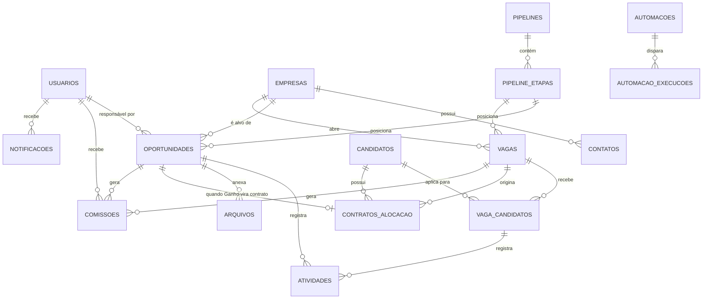

# Modelagem de Dados

PostgreSQL via Supabase, migrations por Prisma. Nomes de tabela em
`snake_case` plural, conforme convenção Prisma/Postgres. Todos os campos
"a IA sugere/calcula" armazenam o valor da IA + timestamp + versão do
prompt/modelo usado — nunca sobrescrevem sem trilha, mesma exigência de
auditoria de `arquitetura.md`.

## Visão geral (ERD simplificado)



## Entidades

### `usuarios`
Espelha `auth.users` do Supabase Auth (1:1, `id` compartilhado).
| Campo | Tipo | Nota |
|---|---|---|
| `id` | uuid (PK, = auth.users.id) | |
| `nome` | text | |
| `papel` | enum | admin, diretoria, consultor_comercial, recrutador, consultor_executive_search, financeiro, cliente_portal, candidato_portal |
| `avatar_url` | text | Supabase Storage |
| `empresa_id` | uuid (FK → empresas, nullable) | preenchido só quando `papel = cliente_portal` |
| `candidato_id` | uuid (FK → candidatos, nullable) | preenchido só quando `papel = candidato_portal` |
| `ativo` | boolean | |

### `empresas`
Clientes e prospects (uma linha por empresa; vira "cliente" quando tem
oportunidade Ganha). Campos ecoam `docs/clientes/_template.md`, agora
estruturados em vez de markdown livre.
| Campo | Tipo |
|---|---|
| `id` | uuid |
| `nome` | text |
| `segmento` | text |
| `porte` | enum (pequena, média, grande, enterprise) |
| `cidade`, `estado` | text |
| `status` | enum (prospect, ativo, inativo) |
| `origem` | text |
| `stack_tecnologica` | text[] |
| `observacoes` | text |
| `criado_em`, `atualizado_em` | timestamptz |

### `contatos`
| Campo | Tipo |
|---|---|
| `id` | uuid |
| `empresa_id` | uuid (FK) |
| `nome`, `cargo` | text |
| `telefone`, `email`, `linkedin` | text |
| `principal` | boolean |

### `pipelines` e `pipeline_etapas`
Genérico para os dois pipelines (Comercial e Vagas) — evita duas tabelas de
etapa quase idênticas.
| Campo (`pipelines`) | Tipo |
|---|---|
| `id` | uuid |
| `tipo` | enum (comercial, vagas) |
| `nome` | text |

| Campo (`pipeline_etapas`) | Tipo |
|---|---|
| `id` | uuid |
| `pipeline_id` | uuid (FK) |
| `nome`, `cor`, `ordem` | text/int |
| `sla_dias` | int nullable |
| `probabilidade_padrao` | numeric(5,2) nullable — usada no Forecast |
| `campos_obrigatorios` | jsonb — ex. `["motivo_perda"]` |
| `is_ganho`, `is_perdido` | boolean — marca as colunas fixas |

### `oportunidades` (Pipeline Comercial)
| Campo | Tipo |
|---|---|
| `id` | uuid |
| `empresa_id` | uuid (FK) |
| `contato_id` | uuid (FK) |
| `etapa_id` | uuid (FK → pipeline_etapas) |
| `responsavel_id` | uuid (FK → usuarios) |
| `vertical` | enum (tecnologia, corporativo, executive_search, alocacao_tech) |
| `origem` | text |
| `valor_estimado` | numeric |
| `probabilidade` | numeric(5,2) — herda da etapa, editável manualmente |
| `previsao_fechamento` | date |
| `produtos` | text[] |
| `motivo_perda` | text nullable |
| `observacoes` | text |
| `criado_em`, `atualizado_em`, `fechado_em` | timestamptz |

### `vagas` (Pipeline de Vagas / ATS)
| Campo | Tipo |
|---|---|
| `id` | uuid |
| `empresa_id` | uuid (FK) |
| `oportunidade_origem_id` | uuid (FK, nullable) — vaga criada a partir de oportunidade Ganha |
| `etapa_id` | uuid (FK → pipeline_etapas) |
| `cargo` | text |
| `vertical` | enum (tecnologia, corporativo, executive_search, alocacao_tech) |
| `consultor_id`, `recrutador_id` | uuid (FK → usuarios) |
| `quantidade_posicoes`, `posicoes_preenchidas` | int |
| `data_abertura`, `data_limite` | date |
| `sla_dias` | int |
| `valor` | numeric |
| `prioridade` | enum (baixa, média, alta, urgente) |
| `tags`, `stack_tecnologica` | text[] |
| `confidencial` | boolean — Executive Search |
| `job_description` | text (rich text) |
| `skills_requeridas` | text[] |
| `gestor_nome`, `gestor_contato` | text |
| `salario_min`, `salario_max` | numeric |
| `beneficios` | text |
| `modelo_trabalho` | enum (remoto, hibrido, presencial) |
| `cidade`, `estado` | text |
| `senioridade` | enum |
| `status` | enum (aberta, fechada, perdida, pausada) |
| `checklist` | jsonb |

Campos específicos de Alocação Tech (`rate`, `prazo_contrato`) vivem em
`contratos_alocacao`, não aqui — uma vaga de Alocação gera um contrato só
quando efetivamente preenchida; a vaga em si é o mesmo objeto das outras
verticais.

### `candidatos`
| Campo | Tipo |
|---|---|
| `id` | uuid |
| `nome`, `foto_url` | text |
| `cargo_atual`, `empresa_atual` | text |
| `cidade`, `estado` | text |
| `telefone`, `whatsapp`, `email`, `linkedin`, `github`, `portfolio_url` | text |
| `curriculo_url` | text (Storage) |
| `skills`, `tecnologias`, `idiomas`, `certificacoes` | text[] |
| `pretensao_salarial` | numeric |
| `disponibilidade` | enum (imediata, 15 dias, 30 dias, indisponível) |
| `status` | enum (ativo, em processo, alocado, inativo) |
| `score_ia`, `score_ia_gerado_em`, `score_ia_modelo` | numeric / timestamptz / text |
| `resumo_ia` | text |
| `observacoes` | text |
| `experiencias`, `formacao` | jsonb (arrays estruturados) |

### `vaga_candidatos` (join — Kanban interno da vaga)
| Campo | Tipo |
|---|---|
| `id` | uuid |
| `vaga_id`, `candidato_id` | uuid (FK) |
| `etapa` | enum (abertas, analise_rh, cv_enviado, entrevista_cliente, forecast, fechada, perdida) |
| `fit_score` | numeric nullable |
| `motivo_perda` | text nullable |
| `criado_em`, `atualizado_em` | timestamptz |

### `contratos_alocacao`
| Campo | Tipo |
|---|---|
| `id` | uuid |
| `vaga_id`, `candidato_id` | uuid (FK) |
| `rate`, `prazo_meses` | numeric/int |
| `data_inicio`, `data_fim` | date |
| `status` | enum (ativo, renovado, encerrado) |
| `renovacao_lembrete_em` | timestamptz — gerado automaticamente |

### `atividades` (timeline unificada)
Polimórfica por `entidade_tipo` + `entidade_id` — uma tabela só para
oportunidade, vaga, candidato e empresa, em vez de quatro tabelas de log
quase idênticas.
| Campo | Tipo |
|---|---|
| `id` | uuid |
| `entidade_tipo` | enum (oportunidade, vaga, candidato, empresa) |
| `entidade_id` | uuid |
| `tipo` | enum (nota, email, whatsapp, ligacao, reuniao, tarefa, mudanca_etapa, automacao) |
| `autor_id` | uuid (FK → usuarios, nullable se `tipo = automacao`) |
| `conteudo` | text |
| `criado_em` | timestamptz |

### `arquivos`
Polimórfica igual a `atividades`. `entidade_tipo/id`, `nome`, `url`
(Storage), `tamanho`, `enviado_por`, `criado_em`.

### `tarefas`
`id`, `titulo`, `descricao`, `entidade_tipo/id` (nullable — tarefa pode ser
avulsa), `responsavel_id`, `prazo`, `status` (pendente/concluída), `origem`
(manual/automação).

### `comissoes`
`id`, `usuario_id`, `origem_tipo` (oportunidade/vaga), `origem_id`, `valor`,
`percentual`, `status` (pendente, aprovada, paga), `competencia` (mês/ano).

### `faturamento`
`id`, `empresa_id`, `origem_tipo/id`, `valor`, `status` (pendente,
faturado, pago), `data_prevista`, `data_efetiva`.

### `automacoes` e `automacao_execucoes`
| Campo (`automacoes`) | Tipo |
|---|---|
| `id` | uuid |
| `pipeline_etapa_id` | uuid (FK, nullable — trigger de entrada em etapa) |
| `evento` | enum (entrou_etapa, saiu_etapa, criado, vencimento_sla, ...) |
| `condicao` | jsonb |
| `acao` | jsonb — `{tipo: "criar_tarefa" | "notificar" | "mover_card" | "enviar_email" | "enviar_whatsapp", params: {...}}` |
| `ativo` | boolean |

`automacao_execucoes` registra cada disparo (auditoria): `automacao_id`,
`entidade_tipo/id`, `resultado`, `erro`, `executado_em`.

### `notificacoes`
`id`, `usuario_id`, `titulo`, `corpo`, `link`, `lida`, `criado_em`.

### `dashboard_layouts`
`id`, `usuario_id`, `dashboard` (enum: principal, comercial, financeiro,
recrutamento, diretoria, consultores, clientes), `widgets` (jsonb —
posição/tamanho por widget), `filtros_salvos` (jsonb).

## RLS — padrão de policy

Toda tabela com dado sensível por papel segue o mesmo padrão de policy
(pseudocódigo, detalhado por tabela na migration real):

```sql
-- exemplo: vagas
create policy vagas_select on vagas for select using (
  auth.jwt() ->> 'papel' in ('admin','diretoria','recrutador','consultor_executive_search')
  or (auth.jwt() ->> 'papel' = 'cliente_portal' and empresa_id = (auth.jwt() ->> 'empresa_id')::uuid)
);
```

Vagas com `confidencial = true` recebem policy adicional restringindo a
`consultor_executive_search` e `admin`, mesmo dentro do grupo que já vê
vagas em geral.
